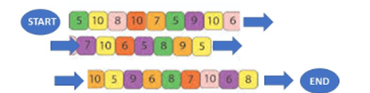

# Java Board Game Simulation 🎲

## Overview 🎮
A Java-based simulation of a custom board game that uses a doubly linked list data structure to represent the game board. The program simulates 1000 games with 1-4 players and calculates statistics on game outcomes.

## Game Board 🎯

## Project Features 🌟
- **Custom Data Structure Implementation:** Uses a doubly linked list to represent the game board
- **Object-Oriented Design:** Implements proper class structure and inheritance
- **GUI Integration:** Provides visual representation of the game board and player positions
- **Statistical Analysis:** Calculates win rates and average moves for different player configurations

## Game Rules 📝
- Players begin on the Start circle
- Each turn, a player rolls a dice (1-6) and moves that many spaces
- Players collect points based on the square they land on
- If a player lands on an occupied square, the previous player must move back 7 spaces
- A player wins when they reach the End circle with at least 44 points
- If a player reaches the End with fewer than 44 points, they return to Start

## Game Screenshot 🖼️
<!-- You can add a screenshot of your game here once you have one -->
<!--  -->

## Technical Implementation ⚙️
### Key Components:
- **DLL.java:** Doubly linked list implementation to represent the board
- **Player.java:** Player class with game statistics tracking
- **Game.java:** Core game logic implementation
- **GUI.java:** Visual representation of the game
- **GameManager.java:** Entry point that manages the application

### Design Highlights:
- Encapsulation of game state within appropriate classes
- Separation of game logic from visualization
- Efficient traversal and manipulation of the game board
- Statistical collection through 1000 simulated games

## Simulation Results 📊
The program outputs statistics for four different player configurations:
- Single player mode (Player A only)
- Two player mode (Players A & B)
- Three player mode (Players A, B & C)
- Four player mode (Players A, B, C & D)

For each configuration, the program calculates:
- Average number of moves to win
- Win rate percentage for each player
- Final board state visualization every 100th game

## Sample Results Table
<!-- This is a placeholder. You can update with your actual results -->
| Players in game | Player A (avg moves/win %) | Player B (avg moves/win %) | Player C (avg moves/win %) | Player D (avg moves/win %) |
|----------------|---------------------------|---------------------------|---------------------------|---------------------------|
| A              | 30 / 100%                 | -                         | -                         | -                         |
| A, B           | 25 / 62%                  | 27 / 38%                  | -                         | -                         |
| A, B, C        | 23 / 35%                  | 24 / 62%                  | 26 / 62%                  | -                         |
| A, B, C, D     | 22 / 27%                  | 20 / 25%                  | 21 / 24%                  | 24 / 24%                  |

## Skills Demonstrated 💪
- Data structure implementation and modification
- Object-oriented programming
- GUI development
- Simulation and statistical analysis
- Game state management
